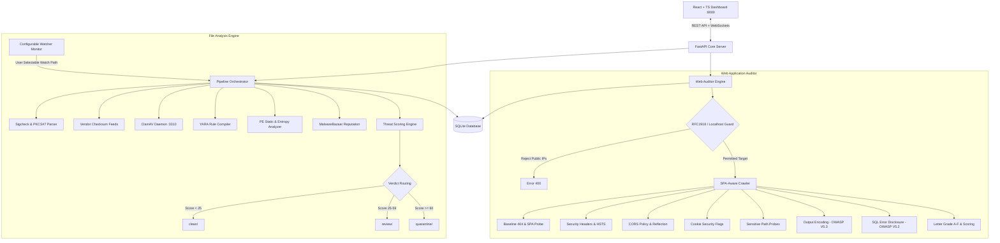

<div align="center">

# 🛡️ Scout Security Platform
### Malware Triage & OWASP Web Security Operations

[](https://python.org)
[](https://fastapi.tiangolo.com)
[](https://react.dev)
[](https://typescriptlang.org)
[](https://vitejs.dev)
[](https://tailwindcss.com)
[](https://sqlite.org)
[]()

<p align="center">
  A production-grade security operations platform built for static binary triage and automated OWASP ASVS web vulnerability auditing. Features runtime-configurable watch folders, non-destructive PE/Authenticode extraction, and unified risk reporting.
</p>

[Quick Start](#-quick-start) • [Architecture](#-architecture) • [Binary Triage Pipeline](#-binary-triage-pipeline) • [OWASP Web Auditor](#-owasp-web-auditor) • [Security Reports](#-security-reports) • [Standalone Deployment](#-standalone--lightweight-deployment)

</div>

---

## 📋 Overview

**Scout** is an integrated security workstation that combines automated binary triage with web application security auditing under a unified dark-mode console.

### Primary Capabilities

- 🔍 **Configurable Binary Triage:** Automated watch-folder pipeline with runtime directory configuration (defaults to `inbox/`, allows selecting any local path, with native folder browsing).
- 📜 **Deep Authenticode & PKCS#7 Extraction:** Directly parses the Windows PE Security Directory and MSI streams to verify code signing, certificates, and SHA-256 digest algorithms.
- 🌐 **OWASP ASVS Web Security Auditor:** Target-agnostic HTTP security auditor strictly bound to private IP subnets (`localhost`, RFC1918 subnets) with intelligent SPA false-positive suppression and offline endpoint error detection.
- 📑 **Unified Security Reports:** Single consolidated report featuring high-level surface metrics first, followed by detected entities ranked from highest to lowest severity, with complete Markdown, JSON, and print-ready export capabilities.
- ⚡ **Live WebSocket Telemetry:** Real-time event bus broadcasting scan progress, intermediate checker results, and threat score adjustments to a React dashboard.
- 🗑️ **Full CRUD Deletion:** 1-click history clearing across all sections (Files, Web Auditor, Live Feed, and Reports) with explicit confirmation modals.

---

## 🏛️ Architecture



---

## 🔬 Binary Triage Pipeline

The file analysis pipeline monitors the designated ingestion directory. When an executable or installer is detected, it is locked into `processing/` and evaluated across six specialized inspection layers:

| Layer | Engine / Tool | Inspection Scope |
| :--- | :--- | :--- |
| **Authenticode & PKCS#7** | `sigcheck.exe` + `pefile` + `asn1crypto` | Verifies digital signature integrity, extracts signer identity, parses PKCS#7 structures directly to inspect digest algorithms (SHA-256 vs weak SHA-1), and validates against trusted publisher allowlists. |
| **Vendor Hash Feeds** | SHA-256 Streaming | Streams cryptographic hashes against local cached feeds for VirtualBox, OWASP ZAP, Wireshark, and LibreOffice. |
| **ClamAV AntiVirus** | `pyclamd` via `127.0.0.1:3310` | High-speed antivirus signature scanning with automatic daemon status monitoring and recovery. |
| **YARA Signatures** | Neo23x0 `signature-base` | Multi-rule scanning targeting ransomware, known backdoors, shellcode indicators, and suspicious strings. |
| **PE Static & Entropy** | `pefile` | Calculates section entropy (detects UPX/Themida packing), audits dangerous Windows API imports (`VirtualAlloc`, `WriteProcessMemory`, `CreateRemoteThread`), and validates PE header timestamps. |
| **Threat Intelligence** | MalwareBazaar API (abuse.ch) | Online SHA-256 reputation lookup with local result caching. |

### Verdict Thresholds
- **`PASS` (Score < 25):** Low risk, valid signatures. File moved to `clean/` (or preserved in-place for custom watch folders).
- **`REVIEW` (Score 25–59):** Suspicious indicators or unsigned binaries. File moved to `review/`.
- **`BLOCK` (Score ≥ 60):** Known malware, high entropy packing, or malicious signatures. File moved to `quarantine/`.

---

## 🌐 OWASP Web Auditor

A purpose-built web vulnerability auditor that maps directly to **OWASP ASVS** criteria:

- 🛡️ **Private Target Guard:** Enforces that audits are strictly executed against `localhost`, `127.0.0.1`, or private subnets (`10.0.0.0/8`, `172.16.0.0/12`, `192.168.0.0/16`). Public IPs/domains are rejected with a clear error.
- 🔌 **Offline Endpoint Detection:** Immediately validates target connectivity. If the port is closed or nothing is listening on the address, it reports an `Error` rather than falsely claiming 100% clean/safe.
- 🎯 **Anti-False-Positive SPA Detection:** When testing Single Page Applications (like React/FastAPI), catch-all routing serves `index.html` with status 200 for missing pages. Scout probes a dynamic baseline 404 token and validates file format signatures to eliminate SPA false alarms.
- 📊 **ASVS Audit Checkpoints:**
  1. **Security Headers:** CSP, X-Frame-Options, X-Content-Type-Options, Referrer-Policy.
  2. **Context-Aware HSTS:** Verifies `Strict-Transport-Security` strictly over HTTPS, skipping HTTP dev servers.
  3. **Cookie Attributes:** Validates `HttpOnly`, `Secure`, and `SameSite` flags on all session cookies.
  4. **CORS Hardening:** Flags wildcard origins and credentialed origin reflections.
  5. **Sensitive File Exposure:** Checks for exposed `.env`, `.git/HEAD`, `/admin`, and `/backup` files.
  6. **Output Encoding (ASVS V5.3):** Sends non-destructive test tokens into query parameters and forms to check for unescaped reflections.
  7. **Database Error Disclosure (ASVS V5.2):** Probes parameters for raw database error disclosures (SQLite, MySQL, Postgres, MSSQL, Oracle).
  8. **Transport Security:** Detects password inputs transmitted over unencrypted HTTP.
  9. **Dangerous Methods:** Checks for active `TRACE`, `PUT`, or `DELETE` capabilities.

---

## 📦 Standalone & Lightweight Deployment

When cloning this repository, the project is **100% self-contained and ready to execute immediately**:

- **No Node.js or npm Required at Runtime**: The frontend React SPA is already prebuilt into `app/web/dist/`. FastAPI serves the compiled bundle directly. You only need Node.js if you want to actively modify and recompile the frontend source code.
- **Optimized Footprint (~262 MB)**: Heavy build-time files (compiler static `.lib` files, `.pdb` debug databases, offline user manuals, and third-party sample installers) are omitted from the repo.
- **Embedded Database & Signatures**: ClamAV runtime binaries, official virus databases (`main.cvd`, `daily.cvd`), and Neo23x0 YARA rule files are included directly in the package.

---

## 🚀 Quick Start

### Prerequisites
- **Operating System:** Windows 10/11
- **Python:** 3.10+ (ensure Python is added to `PATH`)

### 1. Installation

```powershell
# Clone the repository
git clone https://github.com/your-username/scout.git
cd scout/scanner

# Create and activate virtual environment
python -m venv .venv
.\.venv\Scripts\activate

# Install Python requirements
pip install -r app/requirements.txt
```

*(Optional) Copy `.env.example` to `.env` if you wish to configure Abuse.ch or NVD API keys:*
```powershell
cp .env.example .env
```

### 2. Launching Scout

Start the entire platform with one command:

```powershell
.\run.bat
```

Open your browser to:
- **Operations Console:** [http://localhost:8000](http://localhost:8000)
- **Web Security Auditor:** [http://localhost:8000/webscan](http://localhost:8000/webscan)
- **Security Reports:** [http://localhost:8000/tasks](http://localhost:8000/tasks)

---

## 🏦 Standalone Test Target ("El Banco")

A vulnerable banking target application is provided in the sibling directory `../dummy_bank/`:

```powershell
# In a separate terminal:
cd ..\dummy_bank
.\run.bat
```
Runs a lightweight banking app on `http://127.0.0.1:5000` with zero external dependencies to demonstrate all Web Auditor checkpoints.

---

## 🧪 Testing & Verification

Scout includes 39 automated unit and integration tests covering the file checkers, mock HTTP servers, pipeline scoring, and target validation:

```powershell
.\.venv\Scripts\python -m pytest app\tests -o pythonpath=app -v
```

Expected output:
```text
app/tests/test_api.py .............. PASSED
app/tests/test_db.py ............... PASSED
app/tests/test_pe_static.py ........ PASSED
app/tests/test_reputation.py ....... PASSED
app/tests/test_scoring_pipeline.py . PASSED
app/tests/test_signature.py ........ PASSED
app/tests/test_vendor_hash.py ...... PASSED
app/tests/test_vulns.py ............ PASSED
app/tests/test_web_scanner.py ...... PASSED

======================= 39 passed in 14.14s =======================
```

---

## 📦 Standalone Executable & Packaging

Scout is packaged as a self-contained Windows application (`dist\ScannerApp\`) with a dedicated native launcher window:

```
dist\ScannerApp\
├── ScannerApp.exe         # Standalone desktop application launcher
├── _internal\             # Bundled Python runtime, dependencies & prebuilt React dashboard
├── tools\
│   ├── sigcheck.exe       # Sysinternals signature tool
│   └── clamav\            # ClamAV daemon (clamd.exe), freshclam & definitions
├── rules\signature-base\  # 750+ YARA threat detection rules
├── config.yaml            # Relative configuration
├── .env                   # API keys configuration (ABUSECH_KEY, NVD_KEY)
└── data\                  # SQLite database (scanner.db) and logs
```

### Native App Window
When launched (`ScannerApp.exe`), Scout does **not** pop up an unsightly black terminal command prompt. Instead, it displays a sleek dark-themed desktop app window that:
- **Streams Live Terminal Output:** Displays real-time startup diagnostics, ClamAV status, and scan logs directly in an embedded terminal view.
- **`Open` Button:** Instantly opens the Scout dashboard (`http://localhost:8000`) in the default browser.
- **`Exit` Button:** Gracefully terminates background file watchers, shuts down the ClamAV daemon, stops the FastAPI server, and closes the application.
- **Single Instance Protection:** Only one instance runs at a time; launching a second instance automatically focuses and opens the existing dashboard in the browser.

### Rebuilding the Executable
To rebuild `dist\ScannerApp\` from source:
```powershell
powershell -ExecutionPolicy Bypass -File build.ps1
```

### Inno Setup Installer (`ScoutSetup.exe`)
An Inno Setup script is provided at `installer.iss`:
1. Install [Inno Setup 6](https://jrsoftware.org/isdl.php).
2. Right-click `installer.iss` and click **Compile** (or run `"C:\Program Files (x86)\Inno Setup 6\ISCC.exe" installer.iss`).
3. The standalone Windows installer `Output\ScoutSetup.exe` will be generated.

---

## 📄 License


Distributed under the MIT License.
